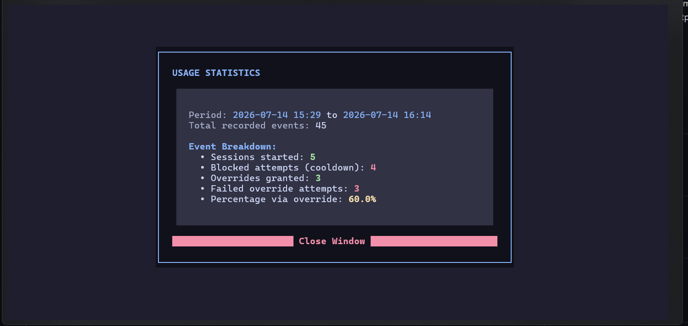
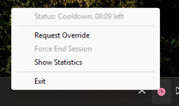
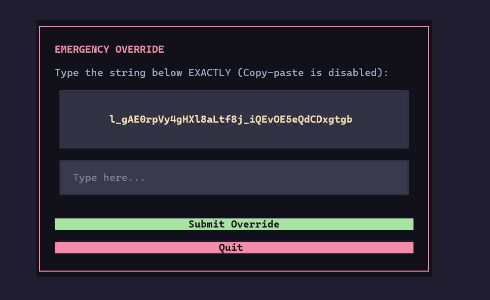

# Desktop App Limiter (Wellbeing Tool)

A lightweight background tool designed to curb digital distractions and combat app addiction (such as Telegram Desktop). It sits silently in your system tray, monitors targeted application usage, enforces maximum session times, and mandates cooldown periods between sessions.

When limits are exceeded, it launches beautifully styled terminal-based (TUI) windows for interactive tasks (such as requesting emergency access or viewing usage statistics).



---

## Features

- **Tray Integration:** Runs quietly in the system tray with controls to check statistics or manually request access.
- **Session Limiting:** Monitors active processes and closes them when they exceed the configured maximum session duration.
- **Cooldown Enforcement:** Imposes a mandatory wait time before the target application can be started again.
- **Emergency Override TUI:**
  - Enter an override challenge to gain temporary access.
  - Requires typing a random 40-character string exactly.
  - Copy-pasting is actively blocked at the widget input level to prevent cheating.
  - Includes a clear "Quit" option to safely back out of the challenge.
- **Usage Statistics TUI:** Displays a detailed report of sessions started, blocked cooldowns, and override history with clean ANSI color coding.
- **Catppuccin Mocha Styling:** Terminal dialogs are fully designed around the Catppuccin theme color scheme.

---

## Screenshots

| System Tray Status | Emergency Override TUI | Usage Statistics TUI |
| :---: | :---: | :---: |
|  |  |  |

---

## Installation

### Prerequisites

Make sure you have Python 3.8+ installed on your system.

### Installing Dependencies

Install the required library packages via pip:

```bash
pip install textual pystray pyperclip Pillow
```

---

## Configuration

You can customize the limiter behavior and styling in the `config.py` file:

- `PROCESS_NAME`: The executable filename of the application you want to limit (e.g., `Telegram.exe`).
- `COOLDOWN_MIN`: The mandatory cooldown duration in minutes between sessions.
- `SESSION_MAX_MIN`: The maximum allowed session length in minutes.
- `OVERRIDE_SESSION_MAX_MIN`: The session duration granted after successfully completing the override challenge.
- `POLL_INTERVAL_SEC`: Interval in seconds at which the background process monitor polls active windows.
- `OVERRIDE_STRING_LEN`: Length of the random challenge string to type.
- `SHOW_EXIT_OPTION`: Boolean (`True`/`False`) indicating whether the "Exit" option should be shown in the system tray menu.
- **Theme Colors:** Customize UI styles using hexadecimal color codes at the bottom of the config.

---

## Usage

Start the background monitoring agent:

```bash
python main.py
```

### CLI Command Options

You can launch specific TUI modules directly from your terminal:

- **Launch Emergency Override Dialog:**
  ```bash
  python main.py --override
  ```

- **Launch Statistics Viewer:**
  ```bash
  python main.py --stats
  ```

### Running on Windows Startup

To run the Wellbeing Limiter automatically in the background when you log in to Windows:

1. **Install to Startup:**
   Run the following command in your terminal:
   ```bash
   python main.py --install-startup
   ```
   This creates a lightweight VBS wrapper in your Windows Startup directory. It launches the limiter via `pythonw.exe`, hiding any background command prompt windows.

2. **Uninstall from Startup:**
   If you wish to stop the application from running on startup, run:
   ```bash
   python main.py --remove-startup
   ```

---

## License

This project is open-source and available under the [MIT License](LICENSE).
